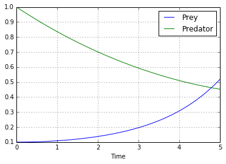
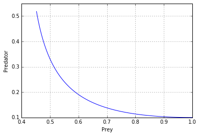
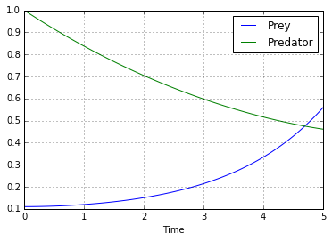

UECM3033 Assignment #3 Report
========================================================

- Prepared by: ** Low Kok Chung **
- Tutorial Group: T2

--------------------------------------------------------

## Task 1 --  Gauss-Legendre formula

The reports, codes and supporting documents are to be uploaded to Github at: 

[https://github.com/LowKokChung/UECM3033_assign3](https://github.com/your_github_id/UECM3033_assign3)

Explain how you implement your `task1.py` here.
In task 1, i implement the  self define function of def gausslegendre(f,a,b,n=20) in order to solve Gauss-Legendre quadrature. In this function, I had found the weights, nodes by using the help of numpy.polynomial.legendre.leggauss. From here, I would be able to find the matrix of  nodes and weights by repeating the process for 20 times. Then, by using the value of nodes found previously, it will be used to find y value which substitutes the pt value into equation y to find the answer by multiplying the value of y with half of b-a where a and b are the integration from a to b which from the task 0 and 1. Meanwhile, pt can be found by from the equation pt=0.5*(b-a)*pt+0.5*(a+b ).Then we will be able to find the integration answer by using gauss legendre quadrature.

Explain how you get the weights and nodes used in the Gauss-Legendre quadrature.

They can be obtained by importing numpy.polynomial.legendre.leggauss.
---------------------------------------------------------

## Task 2 -- Predator-prey model

Explain how you implement your `task2.py` here, especially how to use `odeint`.

In order to generate task 2 to solve the predator-prey model,ODE system with odeint was used. First, a self-define function yp was created which is to identify the equation of differentiated prey and predator equations which was given and the parameters b and c also needed to put into the function. Then, an array with initial condition was created which was when x is 0, y value will be 0.1 and 1.0 respectively. After that, the time of 0 to 5 years will be chopped into 100 sections by using np.linspace(0,5,100). Then the solution will be counted by using the scipy.integrate.odeint of self-defined function,initial condition and the time. In order to plot the graph of prey and predator versus time, the number of prey and predator can be found by taking out the first column and second column respectively. The graph of population 1 can be created. At the same time, the graph of prey 1 also can be created. Then, both the graphs were properly labelled. Then, for the second part, the initial condition was modified where the array will becme 0.11 and 1.0 while others will remain the same.

Put your graphs here and explain.

When the y0 is 0.1, yi is 1.0

When y0 is 0.11, y1 is 1.0

From the graphs shown above, there were just a minor changed in the ouput when there is a changed in the initial condition y0 from 0.1 to 0.11. Meanwhile, the number of prey appeared to be lowest when the predator showed highest number. This indicates that there is an inverse relationship between them. So, when the time increase, the prey will increase while there is a decrease in predators.

Is the system of ODE sensitive to initial condition? Explain.

No, the system of ODE is not sensitive to initial condition. If the system of ODE is sensitive, the small amount changes in starting value will cause the larger changes in the output. However, from the graphs shown above, we can observed that the changes of output is very minor.

-----------------------------------

last modified: change your date here
